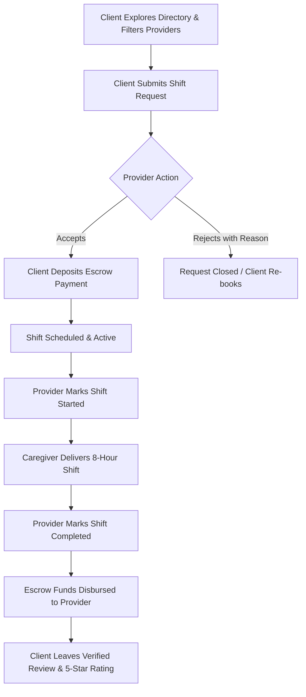

# 🌟 Al-Anis | الأنيس

<div align="center">

<!--  -->

**Verified In-Home Healthcare & Companionship Marketplace**  
_Connecting Egyptian families with audited nurses, elderly companions, child caregivers, and clinical specialists._

[](https://react.dev/)
[](https://vitejs.dev/)
[](https://tailwindcss.com/)
[](https://ui.shadcn.com/)
[](https://tanstack.com/query)
[](https://dotnet.microsoft.com/apps/aspnet/signalr)
[](https://www.i18next.com/)

[Business Overview](#-business-overview) •
[Core Pillars](#-core-business-pillars) •
[Specialties](#-service-specialties) •
[User Portals](#-user-portals--feature-breakdown) •
[Shift Architecture](#-the-shift-based-model) •
[Tech Stack](#-technical-stack) •
[Getting Started](#-getting-started)

</div>

---

## 📖 Business Overview

In Egypt and the broader MENA region, families seeking in-home medical care, elderly companionship, or childcare face critical challenges:

- **Unregulated informal brokers** with zero accountability.
- **Unvetted caregivers** entering private homes without background or credential checks.
- **Unpredictable hourly billing**, clock-watching, and unexpected overtime fees.
- **Financial insecurity** for both clients (who risk paying upfront without service delivery) and caregivers (who face delayed payments).

**Al-Anis (الأنيس)** solves these pain points by offering a modern, trusted digital marketplace. The platform connects clients with credentialed, background-checked healthcare professionals and domestic aides through **standardized 8-hour shift bookings**, **100% digital escrow payment protection**, and **real-time chat monitoring**.

---

## 🛡️ Core Business Pillars

```
                     ┌──────────────────────────────────────────────┐
                     │              AL-ANIS PLATFORM                │
                     └───────┬──────────────┬──────────────┬────────┘
                             │              │              │
           ┌─────────────────▼──┐     ┌─────▼──────┐  ┌────▼─────────────────┐
           │   Audited Care     │     │ Fixed Shift│  │ 100% Escrow Safety   │
           │  • National ID     │     │  • Morning │  │ • Client deposits    │
           │  • Criminal record │     │  • Evening │  │ • Funds held secure  │
           │  • Certifications  │     │  • Night   │  │ • Released on shift  │
           │  • CV screening    │     │  • No meter│  │   completion         │
           └────────────────────┘     └────────────┘  └──────────────────────┘
```

1. **National ID & Criminal Record Vetting**: Every service provider must submit their National ID, criminal status clearance, professional certifications, and CV. Accounts are manually audited and approved by administrators before appearing in the directory.
2. **Fixed 8-Hour Shift Model**: Instead of stressful hourly meters that encourage dragging out tasks, care is delivered in standardized shifts (Morning, Evening, Night) with upfront pricing and zero hidden fees.
3. **100% Escrow Payment Guarantee**: Payments are held in escrow when a booking is confirmed and are only disbursed to the provider once the shift has been completed and verified.
4. **Transparent Admin-Regulated Pricing**: Category rates are centrally managed by platform admins to prevent arbitrary price spikes while ensuring fair compensation for caregivers.
5. **Real-Time SignalR Communication**: Clients and caregivers stay connected before and during shifts via live instant messaging backed by SignalR WebSockets with automatic polling fallbacks.
6. **Verified Community Ratings**: Only clients with completed, paid service requests can submit ratings and reviews, ensuring 100% authentic social proof.

---

## 🩺 Service Specialties

| Specialty                          | Arabic                  | Description                                                                                                       | Starting Rate    |
| ---------------------------------- | ----------------------- | ----------------------------------------------------------------------------------------------------------------- | ---------------- |
| **Home Nursing**                   | تمريض منزلي ورعاية صحية | Certified nurses for post-op recovery, injections, vitals monitoring, IV therapy, and wound care.                 | ~400 EGP / shift |
| **Elderly Care & Companionship**   | رعاية كبار السن وجليسات | Compassionate aides assisting seniors with mobility, companionship, medication schedules, and daily routines.     | ~350 EGP / shift |
| **Child Care & Babysitting**       | رعاية وجليسات أطفال     | Qualified nannies for infants, toddlers, and school-age children providing safe supervision and activities.       | ~250 EGP / shift |
| **Physiotherapy & Rehabilitation** | علاج طبيعي وتأهيل       | Licensed therapists for post-surgery rehabilitation, stroke recovery, and chronic mobility management.            | ~500 EGP / shift |
| **Private Tutoring**               | دروس خصوصية وتأسيس      | Experienced tutors providing foundational support and curriculum tutoring from primary through university levels. | ~200 EGP / shift |

---

## ⏰ The Shift-Based Model

Rather than unpredictable hourly rates, Al-Anis organizes home healthcare and companionship into **8-hour dedicated shifts**:

| Shift          | Working Hours       | Primary Focus                   | Best Suited For                                                                                                |
| -------------- | ------------------- | ------------------------------- | -------------------------------------------------------------------------------------------------------------- |
| ☀️ **Morning** | 08:00 AM – 04:00 PM | Daytime Routine & Clinical Care | Post-op care, vital signs monitoring, medication administration, physical therapy, daytime childcare.          |
| 🌇 **Evening** | 04:00 PM – 12:00 AM | Family Respite & Support        | Evening meal assistance, elderly companionship, homework supervision, preparing for bedtime.                   |
| 🌙 **Night**   | 12:00 AM – 08:00 AM | Overnight Safety & Monitoring   | Continuous overnight vitals, 2-hour repositioning (bed-sore prevention), dementia care, infant night soothing. |

---

## 🔄 Booking & Service Lifecycle



---

## 👥 User Portals & Feature Breakdown

### 1. 🏡 Client Portal (`/app`)

- **Smart Directory & Search**: Filter caregivers by governorate (Cairo, Giza, Alexandria, Dakahlia, Sharqia, etc.), service specialty, shift availability, and price.
- **Caregiver Profiles**: Detailed profiles with verified badges, biography, completed shift stats, working governorates, and client reviews.
- **Interactive Shift Booking**: Date picker, shift selection (Morning/Evening/Night), address details, and upfront price calculation.
- **Request Tracker**: Live status updates across `Pending`, `Accepted`, `In Progress`, and `Completed`.
- **In-App Messaging**: Real-time communication with the booked caregiver.
- **Escrow Checkout**: Multi-method payment processing (Credit Card, Debit Card, Mobile Wallets, Cash).
- **Ratings & Reviews**: Post-service feedback with 5-star ratings and testimonials.

### 2. 🩺 Service Provider Portal (`/provider`)

- **Digital Onboarding**: Multi-step registration submitting National ID, medical/professional certifications, CV, and bio.
- **Application Status Tracking**: Live status monitor while the admin moderation team reviews credentials.
- **Provider Dashboard**: Real-time stats on completed shifts, upcoming jobs, earnings, and acceptance rates.
- **Availability Calendar**: Manage working schedules with single-shift entries and recurring bulk availability.
- **Working Areas**: Select supported Egyptian governorates, cities, and districts.
- **Request Management**: Review incoming booking requests, accept or decline with a reason, and trigger shift lifecycle milestones (`Start Shift`, `Complete Shift`).
- **Real-Time Client Chat**: Coordinate arrival times, clinical instructions, and updates with families.

### 3. 🛡️ Admin Portal (`/admin`)

- **Operations Dashboard**: Platform-wide metrics, active caregivers, completed shifts, transaction volume, and platform revenue.
- **Application Moderation**: Review submitted documents (National ID, credentials, CV) with single-click `Approve` or `Reject` (with explanatory feedback).
- **User & Provider Management**: Search, filter, inspect, activate, or suspend client and provider accounts.
- **Category Management**: Create, edit, and configure service categories with localized names and Lucide icons.
- **Dynamic Pricing Engine**: Set and update fixed shift rates and pricing tiers per category.
- **Financial Audit Logs**: Comprehensive ledger of all escrow transactions, checkout statuses, and provider payouts.

---

## 💻 Technical Stack

### Frontend Core

- **Framework**: [React 19](https://react.dev/) + [Vite 8](https://vitejs.dev/)
- **Routing**: [React Router DOM v6](https://reactrouter.com/) with role-based route protection (`ProtectedRoute`)
- **Styling**: [Tailwind CSS v3](https://tailwindcss.com/) + CSS variables + custom design tokens
- **UI Primitives**: [shadcn/ui](https://ui.shadcn.com/) backed by [Radix UI primitives](https://www.radix-ui.com/)
- **Icons**: [Lucide React](https://lucide.dev/) + RTL-aware directional wrappers
- **Motion**: [Framer Motion](https://www.framer.com/motion/) micro-animations

### State, Networking & Real-Time

- **Server State & Caching**: [TanStack Query v5](https://tanstack.com/query) with hierarchical query keys and optimistic invalidation
- **HTTP Client**: [Axios](https://axios-http.com/) with request/response interceptors and automated JWT token handling
- **Real-Time Messaging**: [@microsoft/signalr](https://www.npmjs.com/package/@microsoft/signalr) with reconnection management and HTTP polling fallback
- **Form Handling**: [React Hook Form](https://react-hook-form.com/) + [Zod](https://zod.dev/) schema validation
- **Analytics & Charts**: [Recharts](https://recharts.org/) data visualizations
- **Toasts**: [Sonner](https://sonner.emilkowal.ski/) notification banners

### Internationalization (i18n)

- **Engine**: [i18next](https://www.i18next.com/) + [react-i18next](https://react.i18next.com/) + [i18next-browser-languagedetector](https://github.com/i18next/i18next-browser-languageDetector)
- **Locales**: Arabic (`ar-EG`, primary) & English (`en-US`)
- **Directionality**: Automated document `dir="rtl"` / `dir="ltr"` switching with RTL-aware logical layout classes (`ms-*`, `me-*`, `ps-*`, `pe-*`)

---

## 📁 Directory Structure

```text
src/
├── api/                    # Modular API client layer (Axios)
│   ├── account.js          # Authentication, OTP, passwords, OAuth
│   ├── admin.js            # Admin moderation, stats, user management
│   ├── axiosClient.js      # Interceptors, token injection, error handling
│   ├── category.js         # Service category endpoints
│   ├── chat.js             # Chat rooms and message queries
│   ├── payments.js         # Checkout and escrow payment queries
│   ├── provider.js         # Provider profiles, availability, working areas
│   ├── requests.js         # Booking requests lifecycle
│   ├── reviews.js          # Ratings and review submissions
│   └── servicePricing.js   # Admin category pricing tiers
│
├── app/                    # Root configuration
│   ├── App.jsx             # Shell container
│   ├── providers.jsx       # QueryClient, AuthProvider, ThemeProvider, Toaster
│   └── router.jsx          # Route hierarchy and role guards
│
├── components/
│   ├── layout/             # Shell layouts (AdminLayout, ClientLayout, ProviderLayout, AuthLayout)
│   ├── shared/             # Reusable domain components (ConfirmDialog, DatePicker, EmptyState, etc.)
│   └── ui/                 # Atomic shadcn/ui primitives (Button, Dialog, Table, Select, etc.)
│
├── context/                # Global contexts (AuthContext, ThemeContext)
├── features/               # Domain-driven feature modules
│   ├── admin/              # Admin dashboard, applications, pricing, users
│   ├── auth/               # Login, register, OTP verification, password reset
│   ├── chat/               # SignalR chat inbox and message thread panels
│   ├── client/             # Directory, provider profile, requests, booking modal
│   ├── landing/            # 11-section high-converting landing page
│   └── provider/           # Provider dashboard, schedule, working areas, incoming jobs
│
├── hooks/                  # Cross-cutting custom hooks (useAuth, useChatSignalR, usePagination, etc.)
├── i18n/                   # Translation dictionaries (ar/ & en/ across 7 namespaces)
├── lib/                    # Constants, validators, and utility functions
├── services/               # SignalR WebSocket connection manager
└── styles/                 # Tailwind custom variables and global stylesheet
```

---

## 🛠️ Available Scripts

| Command            | Action                                            |
| ------------------ | ------------------------------------------------- |
| `npm run dev`      | Starts Vite local development server with HMR.    |
| `npm run build`    | Builds optimized production bundle into `dist/`.  |
| `npm run preview`  | Locally previews production build.                |
| `npm run lint`     | Runs ESLint across `src/` to verify code quality. |
| `npm run lint:fix` | Automatically fixes autofixable ESLint errors.    |
| `npm run format`   | Formats all source files with Prettier.           |

---

## 🔒 Code Quality & Security Standards

- **Zero Tolerance Linting**: ESLint flat configuration strictly enforcing zero unused variables and correct React Hooks dependencies.
- **Git Hooks**: Pre-commit validation powered by [Husky](https://typicode.github.io/husky/) and [lint-staged](https://github.com/lint-staged/lint-staged).
- **Secure Authentication**: JWT-based session tokens with automatic header injection and 401 unauthorized handling.
- **Role-Based Guards**: Protected routes ensure users only access pages matching their assigned role (`User`, `ServiceProvider`, `Admin`).
- **Defensive Error Handling**: Unified mutation error handling via `handleMutationError()` providing localized feedback with zero silent failures.

---

## 👨‍💻 Author & Acknowledgements

Created and maintained by **[Diaa Elsadek](https://github.com/DiaaElsadek)**.

<div align="center">

[](https://github.com/DiaaElsadek)
[](mailto:diaadido1246@gmail.com)

_Designed & developed with care for Egyptian families seeking safe, trusted home healthcare._

</div>
